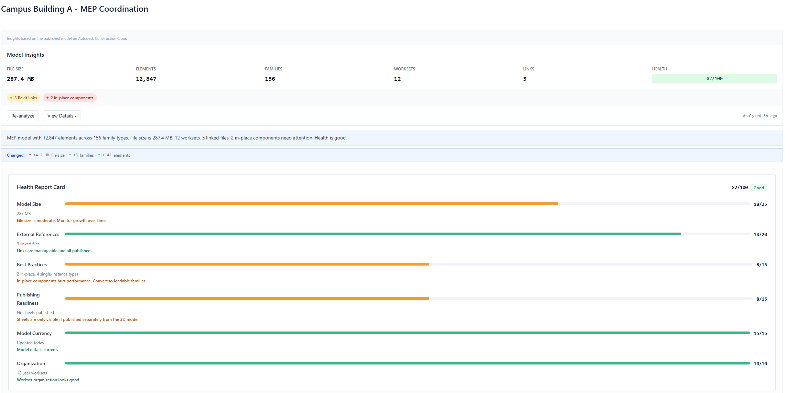
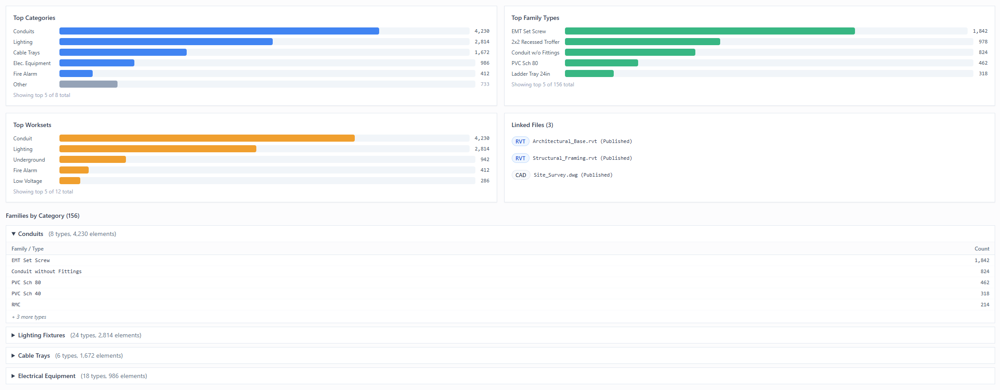
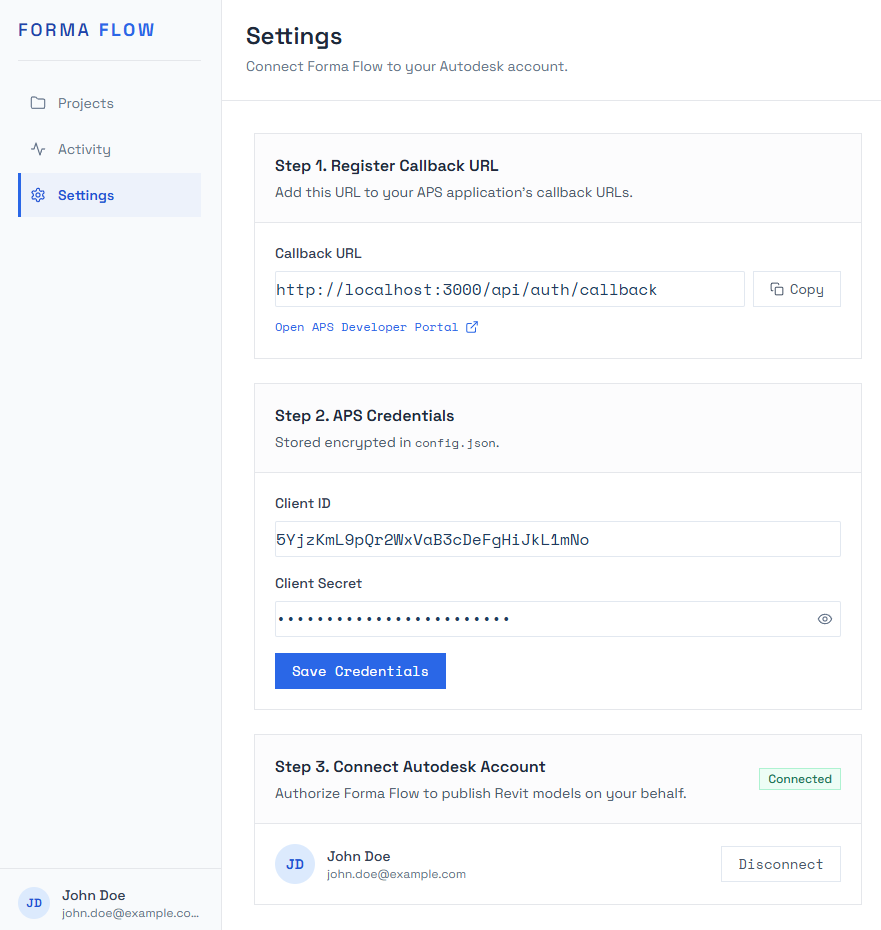
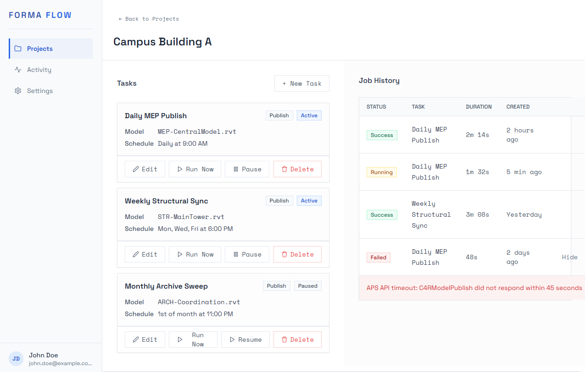
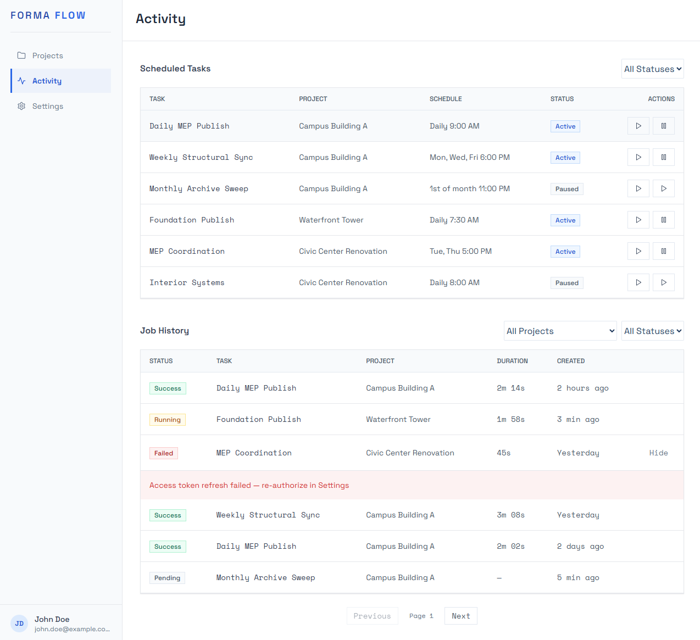

# Forma Flow

Automate your Revit model publishing on Autodesk Construction Cloud. Create tasks once, let Forma Flow publish them on schedule, no manual work required.

<p align="center"></p>

## What Forma Flow Does

Forma Flow is a self-hosted Windows application that:

- **Schedules model publishes** to ACC using Windows Task Scheduler
- **Manages credentials securely** with encrypted storage (AES-256-GCM)
- **Provides a web dashboard** for setup, monitoring, and job history
- **Analyzes published models** with health scoring, family breakdowns, workset distribution, and linked file detection
- **Runs automatically**: the web UI doesn't need to stay open for scheduled tasks to fire
- **Tracks job history** with detailed logs and execution status

Built with Next.js 16, React 19, TypeScript, Tailwind CSS, and the Autodesk Platform Services API.

### Model Insights Dashboard

Automatically extracts metadata from published models on ACC. See health scores, element breakdowns, workset distribution, linked files, and family analysis at a glance.

<p align="center"></p>

Drill into categories, family types, worksets, and linked files with interactive charts. Health report card shows actionable recommendations for each scoring category.

<p align="center"></p>

## Getting Started

### Prerequisites

- **Windows 10 or 11**
- **Node.js 18+** (LTS recommended), [Download here](https://nodejs.org)
- An **Autodesk account** with access to an ACC (Autodesk Construction Cloud) project

### 1. Install Forma Flow

Clone the repo and launch, `start.bat` installs dependencies, starts the local server, and opens your browser.

```bash
git clone https://github.com/schauh11/autodesk-forma-flow.git
cd forma-flow
start.bat
```

The first visit lands you on the Settings page, ready to be configured.

### 2. Create an Autodesk Platform Services (APS) app

Forma Flow connects to ACC through your own APS application. Go to [aps.autodesk.com/myapps](https://aps.autodesk.com/myapps), sign in, and click **Create Application**.

<p align="center"></p>

Fill in the form, name the app whatever you'd like (e.g. "Forma Flow") and set the **callback URL** to:

```
http://localhost:3000/api/auth/callback
```

Enable the scopes `data:read`, `data:write`, and `data:create` so Forma Flow can browse folders and publish models on your behalf.

<p align="center"></p>

Once saved, APS gives you a **Client ID** and **Client Secret**. Keep that tab open, you'll paste those into Forma Flow next.

### 3. Grant the app access in ACC

Your APS app also needs to be authorized inside your ACC account. An ACC admin adds the app's Client ID under **Account Admin → Custom Integrations**.

<p align="center"></p>

If you're not the ACC admin, send your Client ID to whoever is.

### 4. Configure credentials in Forma Flow

Back in the Forma Flow Settings page, paste your **Client ID** and **Client Secret**, then click **Save Credentials**. Credentials are encrypted (AES-256-GCM) before being written to `config.json`, they never leave your machine.

<p align="center"></p>

### 5. Connect your Autodesk account

Click **Connect Autodesk Account**. An Autodesk sign-in popup appears, authorize Forma Flow, and the popup closes automatically.

<p align="center"></p>

The Settings page now shows a green **Connected** badge with your Autodesk name and email. Refresh tokens are encrypted and stored locally.

### 6. Add a project

Go to **Projects** and click **Add Project**. Pick the ACC hub that contains your project.

<p align="center"></p>

Then choose the specific ACC project. The search box helps when you have many.

<p align="center"></p>

The project now appears on your Projects dashboard. Click into it to manage its tasks.

<p align="center"></p>

### 7. Create a scheduled task

Open a project and click **New Task**. Name it, browse ACC to pick a `.rvt` model, and set the schedule, time of day plus which days of the week to run.

<p align="center"></p>

Save the task. Forma Flow registers it with Windows Task Scheduler automatically. At the scheduled time, Windows wakes the app up and publishes your model, even if the browser is closed.

### 8. Monitor runs

The **Activity** page shows every scheduled task and every historical job. Filter by project or status; click a failed job to see the error details.

<p align="center"></p>

That's it. From here the app runs in the background, check Activity whenever you want to confirm things are healthy.

## How Scheduling Works

When you create a task with a schedule:

1. Forma Flow registers a **Windows Scheduled Task** on your machine
2. At the scheduled time, Windows automatically runs `node scripts/publish_task.js`
3. The script publishes your model via the APS API
4. Results are recorded in Forma Flow's database

**The web UI does not need to be running for scheduled tasks to fire.** You can close the browser and check back anytime to see job history and logs.

## Data Storage

All data is stored locally on your machine at `%LOCALAPPDATA%\FormaFlow\`:

- **config.json**: Your APS credentials and encrypted OAuth tokens
- **app.db**: SQLite database with projects, tasks, and job history
- **logs/**: Execution logs for debugging
- **tasks/**: Task definitions and scheduling metadata

## Security and Threat Model

Forma Flow is a single-user local tool. Its threat model is comparable to running Postman with saved Autodesk credentials, or a Python/pyRevit script that holds an APS token. If you understand those, you understand this.

**What it protects:**
- Refresh token is encrypted at rest with AES-256-GCM at `%LOCALAPPDATA%\FormaFlow\config.json`.
- Web UI is bound to `127.0.0.1`. No one on your Wi-Fi, corporate LAN, or VPN can reach it.
- Tokens are redacted from log output (web UI via Pino, worker script via a redactor).
- Outbound traffic only goes to `developer.api.autodesk.com`.

**What it does not protect:**
- **Malware running as your Windows user.** Any process with your permissions can read `config.json`, including the encryption key next to the encrypted token. This is the same exposure as Postman vaults, `.env` files, or `~/.aws/credentials`.
- **Physical access to an unlocked workstation.** Anyone at your unlocked PC can use the UI.
- **Compromised Autodesk account itself.** Independent of Forma Flow.

**Recommendations for safe use:**
- Run on a non-admin Windows account when possible.
- Don't back up `%LOCALAPPDATA%\FormaFlow\` to a shared cloud service. The encryption key and the encrypted token live there together.
- Use your own APS app (don't share Client ID or Secret across machines or users).
- Click **Disconnect** in Settings when stepping away long-term. This deletes the refresh token from disk.

**If you suspect your machine is compromised:**
1. Delete the APS app at https://aps.autodesk.com/myapps. This invalidates every token Forma Flow holds, regardless of what happened to the file.
2. Change your Autodesk password.
3. Clean malware. Delete unfamiliar tasks in Windows Task Scheduler.
4. Optionally delete `%LOCALAPPDATA%\FormaFlow\` for a clean slate.

To report a suspected vulnerability in Forma Flow itself, please open a private discussion or contact the maintainer via GitHub before filing a public issue.

## Architecture

```
Windows Machine
  ├─ Next.js Web UI (http://localhost:3000)
  │  └─ Settings, Projects, Tasks, Activity dashboard
  │
  ├─ SQLite Database (%LOCALAPPDATA%\FormaFlow\)
  │  └─ Projects, tasks, job history
  │
  └─ Windows Task Scheduler
     └─ Runs per-task .bat file at scheduled times
        └─ .bat calls: node scripts/publish_task.js
           └─ Publishes models via APS API
```

| Component | Technology |
|-----------|-----------|
| Web UI | Next.js 16, React 19, TypeScript, Tailwind CSS, shared UI primitives (Button, Badge via CVA) |
| Backend API | Next.js API Routes |
| Database | SQLite (Drizzle ORM) |
| Task Execution | Node.js 18+, Windows Task Scheduler |
| Authentication | Autodesk OAuth 2.0 (3-legged), tokens in local `config.json` |
| Security | AES-256-GCM token encryption |

## Development

### Prerequisites

- Node.js 18+

### Setup Dev Environment

```bash
git clone https://github.com/schauh11/autodesk-forma-flow.git
cd forma-flow
npm install
```

### Run Locally

```bash
# Development server
npm run dev

# Production build
npm run build && npm start

# Run tests
npm run test
```

The app will open automatically at `http://localhost:3000`.

## Environment Variables

Optional overrides for development or advanced setups. **APS Client ID, Client Secret, encryption key, and OAuth tokens are not set via env**, they are saved through the **Settings** page into `%LOCALAPPDATA%\FormaFlow\config.json` (see `.env.example`).

```env
# Optional: development / logging (see src/lib/env.ts)
NODE_ENV=development
LOG_LEVEL=info

# Optional: override the data directory (default: %LOCALAPPDATA%\FormaFlow)
# FORMA_FLOW_DATA_DIR=C:\path\to\custom\data
```

## API Endpoints

| Method | Path | Description |
|--------|------|-------------|
| `GET` | `/api/projects` | List all projects |
| `POST` | `/api/projects` | Create a new project |
| `GET` | `/api/projects/:id` | Get project details |
| `PUT` | `/api/projects/:id` | Update project |
| `DELETE` | `/api/projects/:id` | Delete project |
| `GET` | `/api/tasks` | List all tasks |
| `POST` | `/api/tasks` | Create a new task |
| `GET` | `/api/tasks/:id` | Get task details |
| `PUT` | `/api/tasks/:id` | Update task |
| `DELETE` | `/api/tasks/:id` | Delete task |
| `POST` | `/api/tasks/:id/run-now` | Trigger immediate execution |
| `GET` | `/api/jobs` | Get job history (paginated) |
| `GET` | `/api/jobs/:id` | Get job details and logs |
| `GET` | `/api/hubs` | List ACC hubs |
| `GET` | `/api/hubs/:hubId/projects` | List projects in hub |
| `GET` | `/api/acc/:projectId/folders` | Browse ACC folders |

## Troubleshooting

### "Scheduled tasks not running"
1. Open Windows Task Scheduler
2. Search for "Forma Flow" tasks
3. Check if they're enabled
4. Verify Node.js 18+ is installed and in your PATH
5. Check logs in `%LOCALAPPDATA%\FormaFlow\logs\`

### "OAuth not connecting"
1. Verify your APS Client ID and Secret in Settings
2. Confirm the callback URL in your APS app is `http://localhost:3000/api/auth/callback`
3. Check browser console (F12 → Console tab) for error messages

### "I can't find my .rvt file"
The file browser shows ACC project structure. Make sure you:
1. Selected the correct Hub
2. Selected the correct Project
3. The .rvt file is in the ACC project (not just on your local machine)

## File Structure

```
src/
  app/
    page.tsx                # Root redirect
    (dashboard)/            # Main app pages
      projects/             # Project list and detail views
      activity/             # Task and job history
      settings/             # APS credentials and OAuth
    api/                    # REST API endpoints
  components/               # React UI components
  db/                       # Database schema and connection
  lib/                      # Utilities (APS API, crypto, cron, logging)
```

## Tech Stack

- **Frontend:** Next.js 16, React 19, TypeScript, Tailwind CSS, class-variance-authority (Button/Badge)
- **Backend:** Next.js API Routes, Drizzle ORM
- **Database:** SQLite (better-sqlite3, WAL mode)
- **Task Scheduling:** Windows Task Scheduler + Node.js
- **Authentication:** Autodesk OAuth 2.0 (3-legged)
- **Security:** AES-256-GCM encryption, structured logging with redaction

## License

MIT
